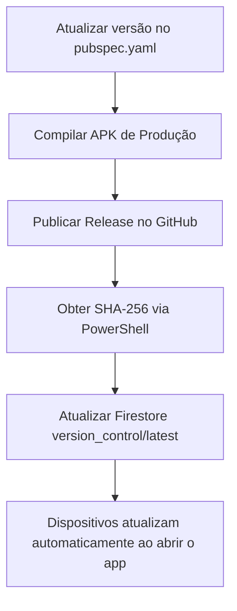

# 🚀 Guia de Publicação de Novas Versões — App CMOC

Este guia descreve o processo passo a passo para compilar, hospedar e publicar atualizações para o aplicativo. Com o mecanismo estilo **Steam** ativo, os dispositivos baixarão e instalarão a nova versão silenciosamente assim que o aplicativo for iniciado.

---

## 📌 Visão Geral do Fluxo



---

## 📋 Passo a Passo

### Passo 1: Incrementar a versão no código
Abra o arquivo [pubspec.yaml](file:///c:/Users/Enzo/Documents/Projetos/Flutter/relatorio-CMOC-app/pubspec.yaml) e modifique a linha `version:` (por volta da linha 19):
```yaml
version: 1.0.1+3
```
* **Versão Nominal (antes do `+`)**: Versão visível do app (ex: `1.0.1`). Siga o padrão SemVer (Major.Minor.Patch).
* **Build Number (depois do `+`)**: Número inteiro incremental de controle interno (ex: `3`). **Você deve sempre aumentá-lo em pelo menos +1 a cada nova compilação.** É através dele que o app detecta a existência de novidades.

---

### Passo 2: Compilar o APK de Produção
No terminal da raiz do seu projeto Flutter, gere o executável otimizado em modo release:
```bash
flutter build apk --release
```
O arquivo APK assinado será gerado no caminho:
📁 `build/app/outputs/flutter-apk/app-release.apk`

---

### Passo 3: Hospedar o APK no GitHub Releases
1. Acesse o seu repositório no GitHub: **[relatorio-CMOC-app](https://github.com/EnzoFirmo14/relatorio-CMOC-app)**.
2. Na barra lateral direita, clique em **Releases** > **Create a new release** (ou *Draft a new release*).
3. Insira a Tag (ex: `v1.0.1`) e o Título (ex: `Release v1.0.1`).
4. **Arraste e solte o arquivo `app-release.apk`** compilado no Passo 2 para a caixa de anexos binários.
5. Clique em **Publish release**.
6. Na lista de arquivos da release publicada, clique com o **botão direito no `app-release.apk`** e escolha **Copiar endereço do link** (Copy link address).
   * *O link terá um formato direto como:*
     `https://github.com/EnzoFirmo14/relatorio-CMOC-app/releases/download/v1.0.1/app-release.apk`

---

### Passo 4: Calcular o Hash de Integridade (SHA-256)
Para que os dispositivos aceitem o download com segurança (prevenindo arquivos corrompidos ou downloads interceptados), o aplicativo exige a validação do hash SHA-256.

Abra o **PowerShell** no Windows e execute o comando:
```powershell
Get-FileHash build\app\outputs\flutter-apk\app-release.apk -Algorithm SHA256 | Format-List
```
O console exibirá as informações do arquivo. Copie a sequência longa de caracteres exibida em **Hash** (ex: `68AE355FE8EAF...`).

---

### Passo 5: Publicar no Firebase Firestore
Acesse o Console do Firebase, abra o **Firestore Database** e selecione a coleção **`version_control`** e o documento **`latest`**. Atualize os seguintes campos:

| Nome do Campo | Tipo de Dado | Valor Exemplo | Descrição |
| :--- | :--- | :--- | :--- |
| **`version`** | `string` | `"1.0.1"` | A versão nominal definida no `pubspec.yaml` |
| **`build_number`** | `number` | `3` | O número de compilação após o `+` no `pubspec.yaml` |
| **`apk_url`** | `string` | `"https://github.com/..."` | Link direto do APK no GitHub Releases (Passo 3) |
| **`sha256`** | `string` | `"68AE355FE8EAF2BF7EFD610..."` | Hash copiado no PowerShell (Passo 4) |
| **`is_mandatory`** | `boolean` | `true` ou `false` | Se `true`, impede o uso do app antigo obrigando a atualizar |
| **`changelog`** | `string` | `"Notas da versão"` | Pequeno resumo do que foi alterado |

---

## ⚡ Comportamento dos Dispositivos (Estilo Steam)

* **Fluxo de Atualização**: Quando o operador clica para abrir o app, o `LauncherPage` (Splash) faz a checagem com o Firestore. Se encontrar uma versão com `build_number` maior do que a instalada localmente, o app **inicia o download na hora**, mostrando o progresso em `%`.
* **Sem interrupção para Offline**: Se o dispositivo estiver offline (ex: no subsolo da mina) ou se ocorrer algum erro na rede, o app ultrapassa o check em 1 segundo e abre a tela de login normalmente, sem travar o operador.
* **Modo Desenvolvedor**: O botão de preenchimento automático de teste (raio) é oculto. Para mostrá-lo, **toque 5 vezes seguidas no logotipo da CMOC** no topo esquerdo do AppBar.

---

## 💡 Dica de Ouro: Instalação Inicial Sem Dores

Para que os operadores leigos nunca vejam a tela de instrução solicitando que ativem fontes desconhecidas para o aplicativo CMOC, quem estiver realizando a configuração inicial no dispositivo (supervisor ou TI) pode conceder essa permissão imediatamente após a primeira instalação manual do APK:

1. Logo após instalar o primeiro APK no celular do colaborador, abra as **Configurações** do Android.
2. Acesse **Aplicativos** > procure por **Relatório CMOC** (ou *CMOC*).
3. Role a tela até a opção **Instalar apps desconhecidos** (ou *Instalar fontes desconhecidas*).
4. **Ative a chave para "Permitir desta fonte"**.

Fazendo isso no primeiro dia de setup, o aplicativo CMOC já terá autorização prévia do Android e **todas as futuras atualizações serão baixadas e instaladas de forma 100% invisível e automática para os colaboradores!**
