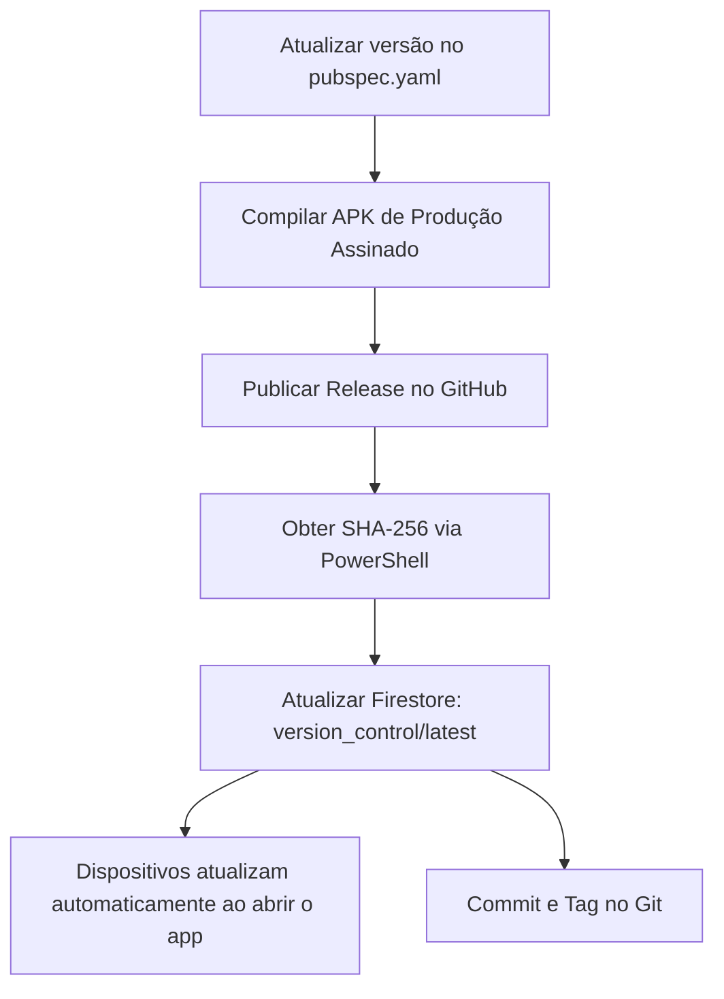

# 🚀 Guia de Publicação de Novas Versões — App CMOC

Este guia descreve o processo completo passo a passo para compilar, hospedar e publicar atualizações para o aplicativo CMOC. Com o mecanismo estilo **Steam** (OTA via GitHub + Firebase), os dispositivos baixam e instalam a nova versão silenciosamente assim que o aplicativo for iniciado.

---

## 📌 Visão Geral do Fluxo


```mermaid
graph TD
    A[Atualizar versão no pubspec.yaml] --> B[Compilar APK de Produção Assinado]
    B --> C[Publicar Release no GitHub]
    C --> D[Obter SHA-256 via PowerShell]
    D --> E[Atualizar Firestore: version_control/latest]
    E --> F[Dispositivos atualizam automaticamente ao abrir o app]
    E --> G[Commit e Tag no Git]
```

---

## 📋 Passo a Passo para Publicação

### Passo 1: Incrementar a versão no código
Abra o arquivo [pubspec.yaml](file:///c:/Codes/Projetos/relatorio-CMOC-app/pubspec.yaml) e modifique a linha `version:`:

```yaml
version: 1.0.5+5
```

**Regras de Versionamento:**
* **Versão Nominal (antes do `+`)**: `MAJOR.MINOR.PATCH` (ex: `1.0.6`).
  * `PATCH (+0.0.1)`: Correções de bugs e pequenos ajustes.
  * `MINOR (+0.1.0)`: Novas funcionalidades e melhorias de tela.
  * `MAJOR (+1.0.0)`: Grandes mudanças arquiteturais ou reformulações.
* **Build Number (depois do `+`)**: Número inteiro sequencial interno (ex: `6`). **Sempre incremente +1 a cada nova compilação.** É através dele que o app identifica a necessidade de atualização.

---

### Passo 2: Verificar a Keystore de Assinatura
Antes de gerar o build de produção, certifique-se de que as chaves de assinatura estão configuradas:
* Arquivo da chave: `android/app/cmoc-release-key.jks`
* Propriedades de acesso: `android/key.properties`

> ⚠️ **ATENÇÃO DE SEGURANÇA**: Nunca envie o arquivo `.jks` nem o `key.properties` para o repositório público do Git.

---

### Passo 3: Compilar o APK de Produção

> ⚠️ **IMPORTANTE**: Sempre use as flags `--build-name` e `--build-number` explicitamente. Sem elas, o Gradle pode utilizar o versionCode em cache e embutir um número de versão desatualizado no APK, ocasionando loops de atualização nos dispositivos.

Execute no terminal da raiz do projeto:

```bash
flutter build apk --release --build-name=1.0.5 --build-number=5
```
*(Substitua `1.0.5` e `5` pela versão e build number configurados no `pubspec.yaml`)*

#### Validar o `versionCode` gravado no APK:
```powershell
$aapt = Get-ChildItem "$env:LOCALAPPDATA\Android\Sdk\build-tools" -Filter "aapt.exe" -Recurse | Sort-Object LastWriteTime -Descending | Select-Object -First 1 -ExpandProperty FullName
& $aapt dump badging "build\app\outputs\flutter-apk\app-release.apk" | Select-String "versionCode"
```
O resultado deve confirmar `versionCode='5'` (ou o número da build atual).

* O APK gerado estará em: `build\app\outputs\flutter-apk\app-release.apk`
* *(Caso necessite de App Bundle para Play Store: `flutter build appbundle --release` gerado em `build\app\outputs\bundle\release\app-release.aab`)*

---

### Passo 4: Hospedar o APK no GitHub Releases
1. Acesse o repositório no GitHub: **[relatorio-CMOC-app](https://github.com/EnzoFirmo14/relatorio-CMOC-app)**.
2. Na barra lateral direita, clique em **Releases** > **Draft a new release** (ou *Create a new release*).
3. Defina a **Tag** (ex: `v1.0.5`) e o **Título** (ex: `Release v1.0.5`).
4. **Arraste e solte o arquivo `app-release.apk`** para a área de anexos binários.
5. Clique em **Publish release**.
6. Na lista de assets da release publicada, clique com o **botão direito no `app-release.apk`** e selecione **Copiar endereço do link** (*Copy link address*).
   * Formato esperado:
     `https://github.com/EnzoFirmo14/relatorio-CMOC-app/releases/download/v1.0.5/app-release.apk`

---

### Passo 5: Calcular o Hash de Integridade (SHA-256)
Para garantir que o download seja seguro e que o arquivo não chegue corrompido aos dispositivos, calcule o SHA-256:

No **PowerShell**, execute:
```powershell
Get-FileHash build\app\outputs\flutter-apk\app-release.apk -Algorithm SHA256 | Format-List
```
Copie o valor exibido no campo **Hash** (ex: `68AE355FE8EAF2BF7EFD610...`).

---

### Passo 6: Publicar no Firebase Firestore
Acesse o Console do Firebase, vá em **Firestore Database** e abra o documento:
📁 Coleção: `version_control`  
📄 Documento: `latest`

Preencha/atualize os campos:

| Nome do Campo | Tipo de Dado | Valor Exemplo | Descrição |
| :--- | :--- | :--- | :--- |
| **`version`** | `string` | `"1.0.5"` | Versão nominal configurada no `pubspec.yaml` |
| **`build_number`** | `number` | `5` | Número de build (`versionCode`) após o `+` |
| **`apk_url`** | `string` | `"https://github.com/.../app-release.apk"` | Link direto do APK gerado no GitHub Releases (Passo 4) |
| **`sha256`** | `string` | `"68AE355FE8EAF2BF7EFD610..."` | Hash SHA-256 gerado no Passo 5 |
| **`is_mandatory`** | `boolean` | `true` | Se `true`, exige a atualização imediata |
| **`changelog`** | `string` | `"Ajustes em Equipagem e Bombeamento"` | Resumo das novidades da versão |

---

### Passo 7: Commit e Tag no Git
Após publicar no Firebase, registre a versão no repositório:

```bash
git add pubspec.yaml COMO_PUBLICAR_VERSAO.md
git commit -m "chore: release v1.0.5"
git tag v1.0.5
git push origin main --tags
```

---

## ⚡ Comportamento dos Dispositivos (Auto-Update Estilo Steam)

* **Detecção Automática**: Ao abrir o aplicativo, a tela de Splash (`LauncherPage`) consulta o Firestore. Se `build_number` do servidor for superior ao local, inicia o download em background exibindo o progresso em `%`.
* **Resiliência Offline**: Se o aparelho estiver sem conexão (ex: subsolo da mina) ou com oscilação na rede, o check faz timeout em 1 segundo e libera o login normalmente sem travar o operador.
* **Modo Desenvolvedor**: O botão de preenchimento automático para testes (ícone de raio) fica oculto. Para exibi-lo, **toque 5 vezes seguidas no logotipo da CMOC** no topo esquerdo do AppBar.

---

## 💡 Instalação Inicial e Permissões

Para que as futuras atualizações sejam **100% invisíveis e automáticas** sem pedir confirmações de permissão ao operador de campo:

1. Ao realizar a primeira instalação manual do APK no aparelho:
2. Abra as **Configurações do Android** > **Aplicativos** > **Relatório CMOC**.
3. Selecione **Instalar apps desconhecidos** (ou *Instalar de fontes desconhecidas*).
4. Marque **"Permitir desta fonte"**.

---

## 📜 CHANGELOG

### v1.0.5 (2026-09-30)
- **Equipagem**: Adicionada opção "Outros" em Causa/Motivo com campo de texto livre.
- **Equipagem > Dutos (Ventilação)**: Novo tipo "Realocação" com campos específicos (Frente de Destino, Local de Origem, Local de Destino, Observação, "Necessário Recuperar?").
- **Bombeamento**: Símbolos e cores de nível de água padronizados (cheio=verde, vazio=vermelho).
- **Bombeamento**: Fim de Rampa com alerta visual abaixo de 20m.

### v1.0.4
- Versão base estável inicial com formulários de Bombeamento, Equipagem, Subestações e sincronização Isar/Firestore.
